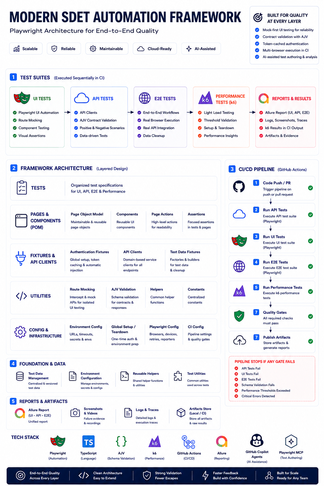
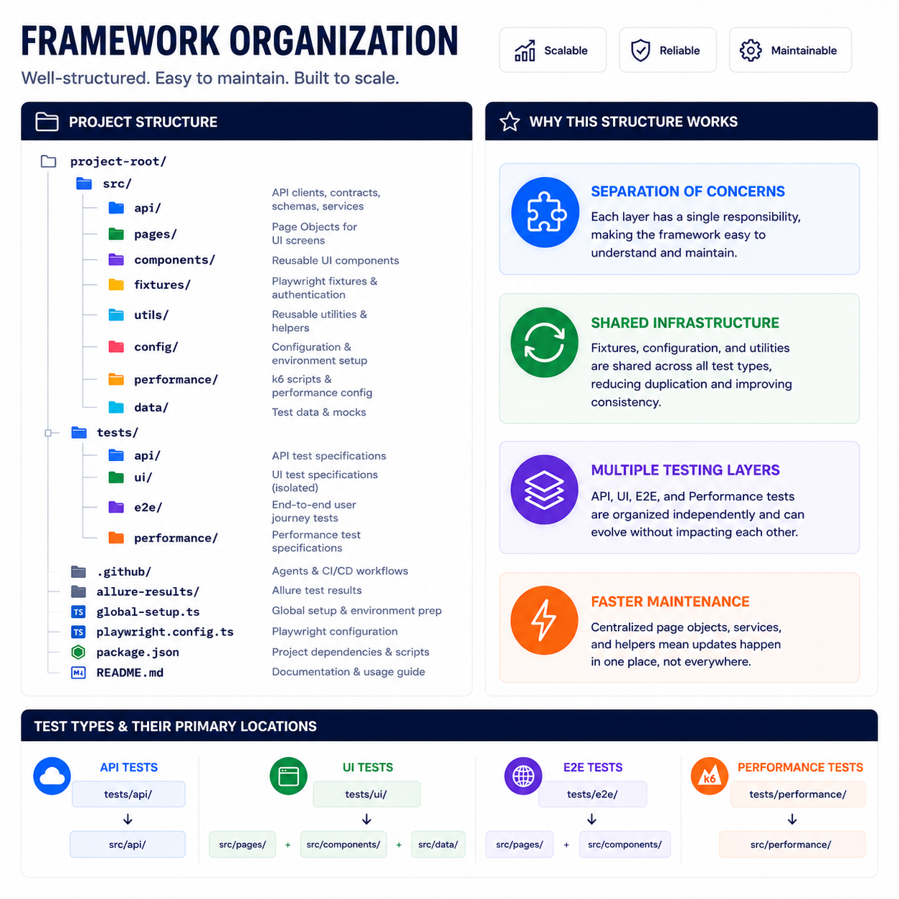
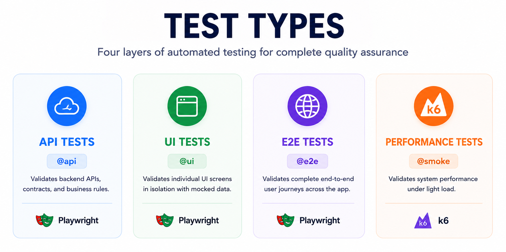
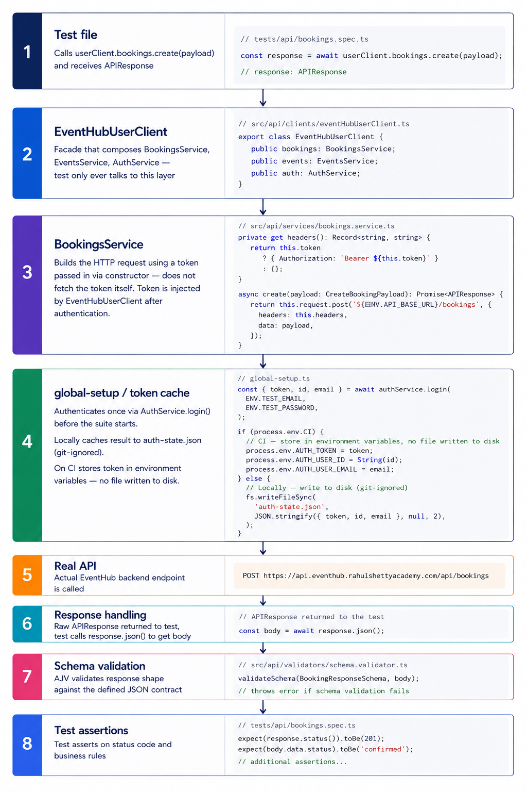

# EventHub Automation Framework

> A production-grade, enterprise-ready test automation framework built against the [EventHub](https://eventhub.rahulshettyacademy.com) practice application.

---


## Table of Contents

1. [What Is This Project?](#what-is-this-project)
2. [What Does It Test?](#what-does-it-test)
3. [Tech Stack](#tech-stack)
4. [Architecture Overview](#architecture-overview)
5. [Folder Structure](#folder-structure)
6. [Getting Started](#getting-started)
7. [How to Run Tests](#how-to-run-tests)
8. [How Each Test Type Works](#how-each-test-type-works)
   - [API Tests](#api-tests)
   - [UI Tests](#ui-tests)
   - [E2E Tests](#e2e-tests)
   - [Performance Tests](#performance-tests)
9. [Authentication Strategy](#authentication-strategy)
10. [AI-Assisted Testing](#ai-assisted-testing)
11. [Reporting](#reporting)
12. [CI/CD Pipeline](#cicd-pipeline)
13. [Troubleshooting](#troubleshooting)
14. [Author](#author)

---

## What Is This Project?

This framework is a full-stack automated test suite for the EventHub web application — a practice platform where users can browse events, make bookings, and manage their tickets. Administrators can manage events and bookings through a dedicated admin interface.

The framework is designed to demonstrate **enterprise-grade automation engineering practices** including:

- Layered test architecture separating API, UI, and end-to-end concerns
- Page Object Model (POM) for maintainable UI automation
- Contract testing with JSON schema validation
- Mocked API responses for isolated UI testing
- Performance testing under simulated load
- AI-assisted test authoring via Playwright MCP and GitHub Copilot agents
- Automated CI/CD pipeline with multi-browser support and published test reports

**You do not need to be a developer to understand what this framework tests.** The sections below explain both the high-level purpose and the technical implementation in detail.

---

## What Does It Test?

EventHub is an event booking platform. This framework verifies that the application works correctly across three layers:

| Layer | What it checks |
|---|---|
| **API** | The backend endpoints respond correctly — right status codes, correct data shapes, proper error handling |
| **UI** | Individual pages render correctly and behave as expected in isolation |
| **E2E** | Full user journeys work end to end — from browsing events through to booking and cancelling |
| **Performance** | The API handles concurrent users within acceptable response time thresholds |

### Key user journeys covered

- User can log in and log out
- User can browse events and navigate to the booking page
- User can complete a booking and see the confirmation
- User can view and cancel their bookings
- Admin can manage events — create, edit, delete
- Admin can manage bookings — view details, cancel

---

## Tech Stack

| Tool | Purpose |
|---|---|
| [Playwright](https://playwright.dev) | Browser automation and API testing |
| [TypeScript](https://www.typescriptlang.org) | Type-safe test code |
| [AJV](https://ajv.js.org) | JSON schema validation for API contracts |
| [k6](https://k6.io) | Performance and load testing |
| [esbuild](https://esbuild.github.io) | Bundles TypeScript performance tests for k6 |
| [Allure](https://allurereport.org) | Test reporting and history |
| [GitHub Actions](https://github.com/features/actions) | CI/CD pipeline |
| [Playwright MCP](https://playwright.dev/docs/mcp) | AI-driven browser interaction for test authoring |
| [GitHub Copilot Agents](https://github.com/features/copilot) | Structured AI workflows for planning, generating, and healing tests |

---

## Architecture Overview

The framework is structured in layers. Each layer has a single responsibility and depends only on the layer below it.

```
Tests
  ↓
Page Objects / API Services
  ↓
Components / Fixtures
  ↓
Utilities / Config
```



### Key design decisions

**Page Object Model (POM)**
Every page and reusable component in the application has a corresponding TypeScript class. Tests call methods on page objects rather than interacting with the DOM directly. This means if the UI changes, only the page object needs updating, not every test.

**Assertions — page objects and tests**
Assertions are split between page objects and test files depending on context. Assertions that will always have the same expected outcome regardless of data or workflow live in `verify` methods on the page object. Assertions where the expected outcome depends on test data or state are written in the test itself, keeping the page object flexible and reusable.

**Fixture-based authentication**
Playwright fixtures handle authentication automatically. Tests declare what they need (`authenticatedPage`, `userClient`) and the fixture provides it — tests never manage tokens or login state themselves.

**Mock-first UI testing**
UI tests intercept API calls and return controlled mock data. This isolates UI behaviour from backend reliability — a flaky sandbox API cannot cause a UI test to fail.

**Schema validation**
Every API test validates the response body against a JSON schema. If the API changes its response shape, the schema validation catches it immediately rather than waiting for a downstream test to break.

---

## Folder Structure

```
├── src/
│   ├── api/
│   │   ├── clients/          # EventHubUserClient — composes all services for test use
│   │   ├── contracts/        # TypeScript interfaces matching the API response shapes
│   │   ├── schemas/          # AJV JSON schemas for response validation
│   │   ├── services/         # One service per API domain (auth, events, bookings)
│   │   └── validators/       # validateSchema() utility
│   ├── components/           # Reusable UI components (navigation, footer, modals)
│   ├── config/
│   │   └── env.ts            # Environment variable config with fail-fast validation
│   ├── data/
│   │   └── ui-test-mock-data/ # Mock API responses for UI tests
│   ├── fixtures/
│   │   └── auth.fixture.ts   # Playwright fixture providing authenticatedPage and userClient
│   ├── pages/                # One class per application page
│   ├── performance/
│   │   ├── config/           # k6 load options and thresholds
│   │   ├── data/             # Shared test data for performance scripts
│   │   └── helpers/          # k6 auth helper
│   └── utils/                # Shared utilities (route mocking, query params, token handling)
│
├── tests/
│   ├── api/                  # API test specs
│   ├── e2e/                  # End-to-end test specs
│   ├── performance/          # k6 performance scripts
│   └── ui/                   # UI test specs
│
├── .github/
│   ├── agents/               # GitHub Copilot agent instructions and standards
│   │   ├── agent-standards.md
│   │   ├── playwright-test-generator.agent.md
│   │   ├── playwright-test-healer.agent.md
│   │   └── playwright-test-planner.agent.md
│   └── workflows/
│       └── playwright.yml    # CI/CD pipeline
│
├── global-setup.ts           # Runs once before all tests — authenticates and caches token
├── playwright.config.ts      # Playwright configuration
├── COMMANDS.md               # Quick reference for common commands
└── .env                      # Local environment variables (never committed)
```

### Key files

| File | Purpose |
|---|---|
| [`src/config/env.ts`](src/config/env.ts) | Centralised environment config — fails fast if any required variable is missing |
| [`src/fixtures/auth.fixture.ts`](src/fixtures/auth.fixture.ts) | Custom Playwright fixture providing authenticated page and API client |
| [`src/api/clients/eventHubUserClient.ts`](src/api/clients/eventHubUserClient.ts) | Facade over all API services — the main interface tests use |
| [`src/api/validators/schema.validator.ts`](src/api/validators/schema.validator.ts) | AJV-powered schema assertion utility |
| [`src/utils/route.utils.ts`](src/utils/route.utils.ts) | Utility for intercepting and mocking API routes in UI tests |
| [`src/utils/token.utils.ts`](src/utils/token.utils.ts) | JWT decode and expiry checking utilities |
| [`global-setup.ts`](global-setup.ts) | Pre-authenticates once before the suite and caches the token |
| [`playwright.config.ts`](playwright.config.ts) | Global Playwright configuration — browsers, timeouts, reporters |
| [`.github/agents/agent-standards.md`](.github/agents/agent-standards.md) | Enforces framework conventions on all AI-generated test output |
| [`COMMANDS.md`](COMMANDS.md) | Quick reference for all common commands |

---

## Getting Started

### Prerequisites

- [Node.js](https://nodejs.org) v18 or higher
- [k6](https://k6.io/docs/get-started/installation/) — for performance tests only

### 1. Clone the repository

```powershell
git clone https://github.com/your-username/modern-sdet-automation-framework.git
cd modern-sdet-automation-framework
```

### 2. Install dependencies

```powershell
npm ci
```

### 3. Install Playwright browsers

```powershell
npx playwright install --with-deps chromium firefox
```

### 4. Configure environment variables

Create a `.env` file in the project root:

```
BASE_URL=https://eventhub.rahulshettyacademy.com
API_BASE_URL=https://api.eventhub.rahulshettyacademy.com/api
TEST_EMAIL=your-test-account@email.com
TEST_PASSWORD=your-test-password
```

> ⚠️ Never commit your `.env` file. It is already in `.gitignore`.

### 5. Verify setup

```powershell
npx playwright test --grep "@smoke"
```

All smoke tests should pass. If they do, your environment is configured correctly.

---

## How to Run Tests

See [`COMMANDS.md`](COMMANDS.md) for the full reference. The most common commands:

```powershell
# Run everything
npx playwright test

# Run by test type
npx playwright test --grep "@api"
npx playwright test --grep "@ui"
npx playwright test --grep "@e2e"
npx playwright test --grep "@smoke"

# Run in a specific browser
npx playwright test --project=chromium
npx playwright test --project=firefox

# Open interactive UI mode
npx playwright test --ui

# View the HTML report after a run
npx playwright show-report

# Generate and open the Allure report
npx allure serve allure-results
```

---

## How Each Test Type Works



### API Tests

**Location:** `tests/api/`

**What they do:** Call the EventHub REST API directly without a browser. They verify that every endpoint returns the correct HTTP status code, response body shape, and error messages.

**How they work:**
1. The `userClient` fixture provides an authenticated API client
2. Tests call service methods (`userClient.events.getAll()`, `userClient.bookings.create()`)
3. The raw `APIResponse` is returned so tests can assert on status codes, headers, and body
4. `validateSchema()` checks the response body matches the defined JSON schema
5. Test data created during the test is cleaned up in `afterEach`

**Example:**
```typescript
// helper creates a fresh event as a test precondition
async function createTestEvent(userClient: EventHubUserClient) {
  const response = await userClient.events.create({
    title: 'Bookable Test Event',
    description: 'Created for booking tests',
    category: 'Conference',
    venue: 'Test Venue',
    city: 'Bangalore',
    eventDate: '2027-06-15T09:00:00.000Z',
    price: 1000,
    totalSeats: 50,
  });
  const body = await response.json();
  return body.data;
}

test('creates booking and returns 201 with valid schema',
  { tag: ['@smoke', '@api', '@regression'] },
  async ({ userClient }) => {
    const event = await createTestEvent(userClient);

    const response = await userClient.bookings.create({
      eventId: event.id,
      customerName: 'Test User',
      customerEmail: 'test@example.com',
      customerPhone: '+91-9876543210',
      quantity: 2,
    });
    const body = await response.json() as Record<string, any>;

    expect(response.status()).toBe(201);
    validateSchema(BookingResponseSchema, body);
    expect(body.data.status).toBe('confirmed');
    expect(body.data.quantity).toBe(2);
    expect(body.data.eventId).toBe(event.id);
    expect(body.data.bookingRef).toMatch(/^B-[A-Z0-9]{6}$/);
    expect(body.message).toBe('Booking confirmed!');
  }
);
```


---

### UI Tests

**Location:** `tests/ui/`

**What they do:** Test individual pages in isolation — verifying that elements render correctly, forms work, and the UI responds correctly to different data states.

**How they work:**
1. The `authenticatedPage` fixture injects a real JWT token into `localStorage` — no UI login needed
2. Route mocks are registered in `beforeEach` using a `setupRouteMocks` helper, so every test in the block starts with controlled data
3. Page objects drive all UI interactions — tests never touch the DOM directly
4. Assertions that always have the same expected outcome live in `verify` methods on the page object; assertions that depend on data or state are written in the test
5. Because data is mocked, these tests are fast, deterministic, and isolated from backend reliability

**Why mock the API?**
The sandbox API is a shared practice environment — it can be slow or unreliable. Mocking isolates the UI behaviour from backend reliability. The auth token remains real because EventHub validates JWTs server-side and would reject a fake one.

**Example:**
```typescript
// mock setup helper — registers all route intercepts for the home page
async function setupRouteMocks(
  page: Page,
  eventsData = mockEvents.threeEvents,
): Promise<void> {
  await mockRoute(page, '**/api/auth/me', mockAuthMe.authenticatedUser);
  await mockRoute(page, '**/api/events*', eventsData);
}

// mocks registered once for all tests in the block
test.beforeEach(async ({ authenticatedPage }) => {
  await setupRouteMocks(authenticatedPage);
});

test('displays three featured event cards',
  { tag: ['@ui', '@regression'] },
  async ({ authenticatedPage }) => {
    const homePage = new HomePage(authenticatedPage);
    await homePage.goto();

    await homePage.eventCards.verifyEventCardVisible('Tech Summit 2027');
    await homePage.eventCards.verifyEventCardVisible('Monsoon Music Night');
    await homePage.eventCards.verifyEventCardVisible('Dilli Diwali Mela');
  }
);
```

---

### E2E Tests

**Location:** `tests/e2e/`

**What they do:** Simulate complete real user journeys across multiple pages using a real browser and real API calls. No mocking — everything is the real application.

**How they work:**
1. Auth token is injected via fixture so tests start in an authenticated state
2. Test data is created via the API before the journey starts (where the journey itself is not what's being tested)
3. The browser drives the full UI flow across multiple pages
4. `afterEach` cleans up any data created during the test via the API — even if the test fails

**Example:**
```typescript
test('user can complete a booking and see the confirmation',
  { tag: ['@smoke', '@e2e', '@regression'] },
  async ({ authenticatedPage, userClient }) => {
    const homePage = new HomePage(authenticatedPage);
    await homePage.goto();
    await homePage.eventCards.bookEventByTitle('Dilli Diwali Mela');

    const bookingPage = new BookEventPage(authenticatedPage);
    await bookingPage.fillBookingForm(CUSTOMER.name, CUSTOMER.email, CUSTOMER.phone);
    await bookingPage.submitBooking();
    await bookingPage.verifyBookingConfirmed(CUSTOMER.name, 1, '$300');

    // capture booking ref for cleanup in afterEach
    const ref = await bookingPage.getBookingRef();
    const response = await userClient.bookings.getByRef(ref);
    const body = await response.json();
    createdBookingId = body.data.id;
  }
);
```
---

### Performance Tests

**Location:** `tests/performance/`

**What they do:** Simulate multiple concurrent users hitting the API under load and verify that response times stay within acceptable thresholds.

**How they work:**
1. Tests are written in TypeScript and bundled with `esbuild` into JavaScript that k6 can execute
2. k6 runs in its own isolated runtime — it cannot use Node.js, Playwright, or any `src/` services
3. A `setup()` function runs once before the load starts — authenticates and creates shared test data
4. The `default` function is the test body — executed repeatedly for each virtual user
5. `teardown()` runs once after all virtual users finish — cleans up test data
6. Thresholds define pass/fail criteria — the test fails if 95% of requests exceed 2 seconds

**Thresholds:**
```
95th percentile response time < 2000ms
99th percentile response time < 5000ms
Error rate < 1%
```

**Example:**
```typescript
export const options = loadOptions; // 10 VUs for 30 seconds

export function setup() {
  const token = getAuthToken();
  // create shared test data once before load starts
  return { token, eventId: createdEvent.id };
}

export default function (data: { token: string; eventId: number }) {
  // this runs for every virtual user on every iteration
  const response = http.get(`${API_BASE_URL}/events`, {
    headers: authHeaders(data.token),
  });
  check(response, { 'GET /events returns 200': (r) => r.status === 200 });
  sleep(1); // simulate realistic think time between requests
}
```
---

## Authentication Strategy

Authentication is handled entirely by the fixture layer. Tests never manage tokens directly.

### How it works

**Step 1 — Global setup (once per suite)**
Before any test runs, `global-setup.ts` calls the auth API once and caches the result:
- **Locally:** saves `auth-state.json` to the project root (git-ignored)
- **On CI:** stores the token in environment variables — no file written to disk

**Step 2 — Fixture reads the cache**
The `userClient` fixture reads the cached token. Before using it, it checks the JWT expiry:
- If the token is valid and not expiring soon → use it directly, no API call
- If the token is missing or expiring within 5 minutes → re-authenticate automatically

**Step 3 — Token injection for browser tests**
The `authenticatedPage` fixture injects the token into the browser's `localStorage` before the page loads, simulating a logged-in user without going through the login UI.

### Why this approach?

Without token caching, every test would make a login API call before starting. With 50+ tests this means 50+ login requests — slow, wasteful, and a source of flakiness if the sandbox API is unreliable. The global setup approach reduces this to a single login call per test run regardless of suite size.

---

## AI-Assisted Testing

This framework integrates **Playwright MCP** and **GitHub Copilot Test Agents** to support AI-assisted test authoring directly inside VS Code. This is separate from the core Playwright install — the base framework handles automation, MCP adds AI-driven browser interaction on top.

### What is Playwright MCP?

Playwright MCP (Model Context Protocol) allows AI tools like GitHub Copilot to interact with a real browser through Playwright. Instead of guessing at page structure, the AI uses structured accessibility snapshots to understand elements reliably.

Useful for:
- Exploratory testing — let the AI browse the application and identify test scenarios
- Locator discovery — find the right selectors without inspecting the DOM manually
- Test generation — generate test scaffolding from a live browser session
- Debugging — let the AI interact with a failing state to diagnose the problem

### What are Playwright Test Agents?

Playwright Test Agents provide three structured workflows that integrate with GitHub Copilot inside VS Code:

| Agent | File | Purpose |
|---|---|---|
| **Planner** | `.github/agents/playwright-test-planner.agent.md` | Explores the application and produces a structured test plan in Markdown |
| **Generator** | `.github/agents/playwright-test-generator.agent.md` | Takes a test plan and generates Playwright test code |
| **Healer** | `.github/agents/playwright-test-healer.agent.md` | Analyses failing tests and suggests fixes for broken locators or assertions |

### Agent Standards

[`.github/agents/agent-standards.md`](.github/agents/agent-standards.md) sits alongside the agent files and is loaded by GitHub Copilot as context whenever the agents run. It enforces the framework's conventions on every AI-generated test:

- Import `test` from the auth fixture, never from `@playwright/test` directly
- Use `ENV` config, never access `process.env` directly
- Follow the locator priority order (`getByTestId` → `getByRole` → `getByLabel` → `getByPlaceholder` → `getByText` → CSS)
- Follow page object structure and method naming conventions
- Always tag tests correctly (`@smoke`, `@ui`, `@api`, `@e2e`, `@regression`)

> Agent-generated tests should always be reviewed and refined manually before committing.

---

### Setup

#### Prerequisites

- Node.js 18+
- VS Code
- GitHub Copilot extension installed

#### Install Playwright MCP in VS Code

1. Open the Command Palette — `Ctrl + Shift + P`
2. Select **MCP: Add Server**
3. Choose **NPM Package**
4. Install `@playwright/mcp`

VS Code automatically creates the MCP configuration.

#### Initialize Playwright Test Agents

Run from the project root:

```powershell
npx playwright init-agents --loop=vscode
```

This initializes the planner, generator, and healer agent workflows for VS Code and GitHub Copilot. Generated files are placed under `.github/agents/`.

---

### Validate the Setup

#### Validate MCP

Ask GitHub Copilot in VS Code:

> *Navigate to https://demo.playwright.dev/todomvc and add a todo item.*

If MCP is working correctly, Copilot should open and control the browser through Playwright.

#### Validate Playwright Agents

Ask GitHub Copilot in VS Code:

> *Use the Playwright planner to explore the EventHub application and create a test plan.*

If the agents are working correctly, Copilot should use the planner workflow to explore the application and generate a structured Markdown test plan.

---

## Reporting

### Playwright HTML Report

Generated automatically after every run. Shows pass/fail status, error messages, screenshots on failure, and traces.

```powershell
npx playwright show-report
```

### Allure Report

Richer reporting with history, trends, categories, and retry tracking.

```powershell
# Generate and open in browser
npx allure serve allure-results

# Generate to folder then open
npx allure generate allure-results --clean -o allure-report
npx allure open allure-report
```

### GitHub Pages (CI)

On every push to `main`, the CI pipeline publishes the Allure report to GitHub Pages automatically. This gives the team a permanent, browsable test report without needing to run anything locally.

---

## CI/CD Pipeline

**Location:** [`.github/workflows/playwright.yml`](.github/workflows/playwright.yml)

The pipeline runs automatically on every push to `main` or `master`, and on every pull request. It can also be triggered manually.

### Job order

```
api-tests → ui-tests → e2e-tests → performance-tests → report
```

Each job only runs if the previous job passes. This means a broken API will stop the pipeline before wasting time running browser tests.


### Jobs

| Job | Runs on | What it does |
|---|---|---|
| `api-tests` | ubuntu-latest | Installs deps, waits for API health check, runs `@api` tests |
| `ui-tests` | ubuntu-latest | Installs deps + Chromium + Firefox, runs `@ui` tests |
| `e2e-tests` | ubuntu-latest | Installs deps + Chromium + Firefox, runs `@e2e` tests |
| `performance-tests` | ubuntu-latest | Installs deps + k6, builds and runs performance scripts |
| `report` | ubuntu-latest | Downloads all Allure results, generates combined report, deploys to GitHub Pages |

### Secrets required

The following secrets must be configured in your GitHub repository settings under **Settings → Secrets and variables → Actions**:

| Secret | Description |
|---|---|
| `TEST_EMAIL` | Email address of the test account |
| `TEST_PASSWORD` | Password of the test account |

---

## Troubleshooting

### Tests fail with `Missing required environment variable`
Your `.env` file is missing or incomplete. Make sure it contains all four required variables — see [Getting Started](#getting-started).

### Tests fail with `socket hang up` or network errors
The EventHub sandbox API is a shared practice environment and can be intermittently unavailable. The framework has `retries: 1` configured so transient failures are automatically retried. If failures persist, check that the API is reachable:
```powershell
curl https://api.eventhub.rahulshettyacademy.com/api/health
```

### `auth-state.json` not found warning in fixture logs
The cached token file doesn't exist yet — this happens on the first run or after deleting it. The fixture will fall back to a fresh API login automatically. Run the full suite once to generate it:
```powershell
npx playwright test --grep "@smoke"
```

### Performance tests fail to build
Make sure k6 is installed and the build script runs first:
```powershell
npm run k6:build
```
Check that the output file exists at `dist/performance/events.perf.js` before running k6.

### Browser tests fail with a blank white screen
This indicates the auth token was not injected into `localStorage` before the page loaded. Delete `auth-state.json` and rerun — the global setup will generate a fresh token:
```powershell
Remove-Item auth-state.json
npx playwright test
```

### Tests pass in Playwright but show as failed in Allure
If the **Retries** tab on the test shows multiple attempts, the test is genuinely flaky — it passed on retry. This is expected behaviour with the sandbox API. The `retries: 1` config handles this automatically. Track which tests retry consistently — if the same tests always retry, there may be a timing issue worth investigating.

---

## Author

**Your Name**
- LinkedIn: [linkedin](https://linkedin.com/in/andrew-bartle-25a879402)

---

> This framework was built as a demonstration of enterprise-grade SDET practices against the [EventHub](https://eventhub.rahulshettyacademy.com) practice application by Rahul Shetty Academy.
